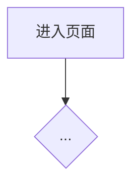

# 企业认证 · 技术方案 `<feature-id>`

| 字段 | 值 |
|------|-----|
| 需求文档 | `docs/requirements/features/<id>.md` |
| 摸底文档 | `docs/design/features/<id>-codebase-map.md`（须已核实） |
| 状态 | ☐ 草案　☐ 评审中　☐ **已锁定** |
| 锁定确认 | （人/日期） |

## 1. 目标与不交付

- **交付**：
- **不交付（OUT）**：

## 2. 需求条款映射

| 需求条款 | 方案落点（切片/模块） | 验收方式 |
|----------|----------------------|----------|
| | | |

## 3. 交互与数据时机（强制 · 文字）

> 流程图可附后，**不能替代**本节。

| 事件 | 是否拉 KYB / 回填 / 对比 | 与草稿关系 | 失败时 |
|------|--------------------------|------------|--------|
| 进入页面 | | | |
| 点击下一步 | | | |
| 离开再进入 | | | |
| 提交前 | | | |
| AB 未命中 | | | |

说明（自由文字，写清「何时重新获取 KYB 用于对比用户填写」）：

## 4. 承载形式与命名（强制）

| 能力 | 承载（hook/组件/函数/配置） | 建议名称 | 业务含义 | 目录路径 |
|------|------------------------------|----------|----------|----------|
| | | | | |

关键参数：

| 参数名 | 含义 | 来源 |
|--------|------|------|
| | | |

## 5. 改旧 vs 新增（强制）

| 改动点 | 策略（改旧 / 新增） | 若新增：不复用理由 | 触及文件 |
|--------|---------------------|--------------------|----------|
| | | | |

## 6. 站点 / 国家差异

| 差异点 | 大陆 | 香港 | 实现方式（配置键/策略/分支） |
|--------|------|------|------------------------------|
| API | | | |
| 字段 | | | |
| 拦截 | | | |
| 交互 | | | |

## 7. 渠道与 AB

- 新渠道：
- 调用链（文字步骤）：
- AB key / 默认 / 未命中：

## 8. 切片计划

| 切片 | 范围 | 依赖 | 验收点 |
|------|------|------|--------|
| S1 | | | |
| S2 | | | |

## 9. 禁忌与风险对照

| 禁忌 ID | 本方案如何规避 |
|---------|----------------|
| T1 错误兜底 | |
| T4 跨地默认 | |
| T5 曲解改旁路 | |
| 其他 | |

## 10. 验证

- 单测/集成：
- 手工：多站点 × AB on/off
- 交付：`verification-gate`

## 附录 · 流程图（可选）

