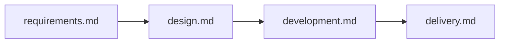

# 工作流剧本（Playbooks�?

> **剧本 SSOT**：`workflows/`  
> 触发表：`skill workflow-triggers`

## 何时触发

用户说：

- 「需求工作流」「走需求流程」「提需求」→ **需�?*
- 「设计工作流」「UI 设计」「设计稿�?Vue」→ **设计**
- 「开发工作流」「开始实现」「修 bug」→ **开�?*
- 「交付工作流」「验收」「DoD」「准�?PR」→ **交付**
- 「端到端」「从需求到交付」→ 按顺�?**需�?�?设计（可选）�?开�?�?交付**

收到上述信号时：**先读�?Skill 选定剧本，再打开对应 workflow 文件逐步执行�?*

**智能体模�?*：执行各阶段时对�?`workflows/agent-patterns.md`（理论见 `workflows/agent-patterns.md`）�?识别路由、委派、并行、Eval、Handoff、人类确认等模式，遵守全局反模式�?

---

## 四条主流程（一键索引）

| 工作�?| 剧本文件 | 终点产出 |
|--------|----------|----------|
| 需�?| `workflows/requirements.md` | 已定�?`docs/requirements/features/<id>.md` + 计划 + eval 草案 |
| 设计 | `workflows/design.md` | UI 方向 / 稿转代码 / a11y 清单 / design 文档 |
| 开�?| `workflows/development.md` | 代码 + 文档同步 + 栈审�?|
| 交付 | `workflows/delivery.md` | DoD PASS + �?PR |

模式对照：`workflows/agent-patterns.md` · 总览：`workflows/README.md`

---

## 执行协议（每条工作流通用�?

1. **打开剧本** �?读对�?`workflows/<name>.md`
2. **识别模式** �?�?`workflows/agent-patterns.md` 中该工作流对应段落（路由/委派/并行/Eval…）
3. **按阶段表顺序** �?每阶段：
   - 读列出的 **Skill**（`skill <name>`�?
   - 委派列出�?**Agent**（`@name` �?Task�?
   - 遵守列出�?**Rules**（`rule <name>`�?
3. **阶段门禁**未通过 �?**STOP**，不进入下一阶段
4. **跨会�?* �?**Handoff 模式**：`dynamic-workflow-mode` + handoff 文件
5. **声称完成** �?**Eval 循环**收尾：至�?`verification-gate`；完整走 **交付** 剧本

---

## 端到端串联（新功能默认）

```
需求工作流（定稿）
  �?设计工作流（有大 UI 时）
  �?开发工作流
  �?交付工作�?
```



---

## 与各 Skill 关系

| 本剧�?| 不替�?| 说明 |
|--------|--------|------|
| workflow-playbooks | `workflow-triggers` | triggers 负责**信号路由**；playbooks 负责**阶段串联** |
| workflow-playbooks | 各阶�?Skill | 剧本指向具体 Skill，不重复 Skill 内步�?|

---

## 维护

- 改阶段顺�?/ 增删 Agent/Rule �?�?`workflows/*.md`
- 新增第四条以外的流程 �?新增 `workflows/<name>.md` + 更新本文件索�?+ `workflow-triggers`
